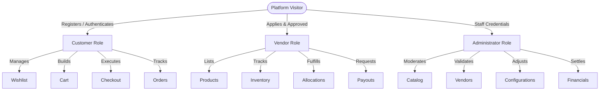

# Software Requirements Specification (SRS)

## Functional Blueprint for the Smart Deal E-Commerce Platform

---

## 1. Project Overview

### 1.1 Purpose of Smart Deal

Smart Deal is a high-performance, multi-vendor e-commerce platform designed specifically for the United Arab Emirates (UAE) market. The platform bridges the gap between local merchants (vendors) and online shoppers (customers) through a streamlined, highly visual, and transactional marketplace. It aims to offer UAE residents a seamless shopping experience with localized features, swift delivery, secure payment mechanisms, and transparent vendor-customer relations.

### 1.2 Business Objectives

- **Empower Local Commerce:** Provide UAE small-to-medium enterprises (SMEs) and established brands with an enterprise-grade digital storefront to showcase and sell products online with minimal setup friction.
- **High-Trust Marketplace:** Build a reliable ecosystem through rigorous vendor verification, verified customer reviews, transparent return policies, and secure transactions.
- **Logistical Optimization:** Establish localized delivery rules covering all seven Emirates of the UAE to guarantee fast transit times and optimized shipping rates.
- **Financial Growth:** Generate revenue through direct vendor commissions, logistics surcharges, premium advertising placements, and featured product listings.

### 1.3 Target Audience

- **Customers:** Residents and visitors across the United Arab Emirates (citizens and expatriates) seeking a wide selection of products with reliable shipping, local currency support (AED), and simple localized checkout options.
- **Vendors:** UAE-based retail merchants, distributors, home-based businesses, and brand owners holding valid commercial trade licenses who wish to expand their customer base without managing their own complex e-commerce infrastructures.
- **Administrators:** Platform owners and operations managers who supervise catalog moderation, vendor validation, dispute resolution, logistics coordination, and platform configurations.

### 1.4 UAE-Focused Marketplace Features

- **Emirate-Based Logistics:** Dynamic delivery calculation and routing tailored to the specific characteristics of the seven Emirates (Dubai, Abu Dhabi, Sharjah, Ajman, Umm Al Quwain, Ras Al Khaimah, and Fujairah).
- **UAE VAT Compliance:** Automated 5% standard Value Added Tax (VAT) application, display, collection, and generation of tax invoices compliant with the Federal Tax Authority (FTA) regulations.
- **Local Address Conventions:** Shipping address templates customized for UAE geographic formatting, emphasizing Building Name/Number, Villa Number, Floor, Street, Area/Community, Landmark, and selected Emirate, rather than traditional postal codes.
- **SMS & Phone Verification:** Native support for UAE phone numbers (+971 format) for registration, OTP login, and critical order alerts.

### 1.5 Key Platform Goals

- **Performance & Responsiveness:** Intuitive, fast-loading visual storefront that ensures minimal page-load latency.
- **Conversion Optimization:** A frictionless, multi-step checkout workflow designed to minimize cart abandonment.
- **Catalog Quality:** Strict moderation workflows ensuring high-quality images, accurate descriptions, correct category categorization, and authentic brand assignments.
- **Operational Transparency:** Traceable audit logs, comprehensive dashboards for all user roles, and distinct financial settlement ledgers.

---

## 2. User Roles



### 2.1 Customer

The Customer is the primary consumer user of the platform. Their journey spans from initial browsing to post-purchase support.

#### 2.1.1 Registration & Authentication

- **Multi-Channel Sign-up:** Ability to create an account using an Email and Password combination, a Google Social Account, or a verified UAE Phone Number via SMS OTP.
- **Account Verification:** Mandatory email verification link or SMS OTP verification to activate the account.
- **Authentication Modes:** Secure login via password, Google single-sign-on (SSO), or one-time passcode (OTP) delivered to the verified mobile number.
- **Password Recovery:** "Forgot Password" self-service triggers a secure, time-limited reset link to the registered email address.

#### 2.1.2 Profile & Address Management

- **Personal Profile:** Edit name, profile picture, gender, primary email address, and contact number.
- **Multi-Address Book:** Save multiple shipping and billing addresses. Address inputs must capture:
  - Receiver's Full Name and Phone Number.
  - Emirate (Selection dropdown of the 7 Emirates).
  - Area/Community Name.
  - Street Name / Number.
  - Building Name, Floor, Apartment/Office Number, or Villa Number.
  - Nearest Landmark.
  - Address Type Identifier (e.g., Home, Office).
  - Primary Flag (Mark one address as the default shipping and/or billing destination).
- **Account Settings:** Toggle notification preferences (Email, SMS, Push) and change passwords securely.

#### 2.1.3 Browsing, Search, & Discovery

- **Catalog Navigation:** Browse items through a multi-tier category tree (Category -> Subcategory).
- **Keyword Search:** Search for products using keywords, brands, tags, or SKUs with real-time suggestions.
- **Advanced Filtering:** Filter search results by price range, brand, color, size, rating, discount percentage, availability, and specific product attributes.
- **Sorting:** Order products by relevance, price (low-to-high, high-to-low), average rating, popularity (sales volume), and release date (newest first).
- **Interaction History:** View lists of "Recently Viewed Products" and access AI-driven "Recommended Products" based on purchase patterns.

#### 2.1.4 Shopping Cart & Wishlist

- **Wishlist Management:** Save products for later purchase. Wishlist items can be added, removed, or transferred directly to the shopping cart.
- **Cart Operations:** Add products (with variant selections), update quantities, remove items, or mark items to "Save for Later" (retaining them in a separate list beneath the active cart).
- **Cart Synchronization:** Access a consistent cart across devices when logged in. Guest carts automatically merge with the customer's account cart upon successful login.

#### 2.1.5 Checkout & Order Fulfillment

- **Checkout Execution:** Transition cart to active checkout, select/enter shipping and billing addresses, select delivery speed, apply promotional coupons, review the summary breakdown (subtotal, shipping fees, VAT, discounts), and finalize payment.
- **Payment Selection:** Choose between online payment (Credit/Debit Card) or Cash on Delivery (COD).
- **Order Tracking:** Monitor the active progress of orders through a visual status timeline.
- **Order History:** View comprehensive logs of all completed, cancelled, and returned purchases, with download links for official VAT-compliant PDF invoices.

#### 2.1.6 Returns, Refunds, & Feedback

- **Order Cancellation:** Cancel orders prior to the vendor changing the status to "Shipped."
- **Return Requests:** Initiate return requests for eligible items within the return window (typically 14 days post-delivery), specifying the reason and uploading supporting images if required.
- **Refund Status:** Track whether refunds are being processed to the original card or assigned as store credit.
- **Ratings & Reviews:** Rate purchased products on a 1-to-5 star scale, write detailed text reviews, upload product photos, and flag reviews as "Verified Purchases."

---

### 2.2 Vendor

A Vendor is a merchant partner responsible for uploading products, managing their independent inventories, fulfilling orders, and requesting payouts.

#### 2.2.1 Registration & Onboarding

- **Merchant Sign-up:** Form submission capturing business name, trade license number, corporate address, primary contact details, bank details, and VAT registration certificate (optional/mandatory depending on threshold).
- **Onboarding Stages:** New vendor applications enter a "Pending Review" status. Vendors cannot list active products until an Administrator approves their trade license and verification documents.
- **Storefront Settings:** Manage the public vendor store page, including banner image, store logo, description, social media links, support contact details, and return address.

#### 2.2.2 Product Management

- **Product Creation:** Upload new products by submitting titles, multi-language descriptions, brand assignments, category classifications, tags, search terms, and high-resolution images.
- **Variant Management:** Configure size, color, material, and packaging options, assigning a unique SKU, barcode, and specific pricing to each variant combination.
- **Approval Pipeline:** Newly uploaded or edited products enter a "Pending Approval" state. Products become visible to customers only after Administrator approval.

#### 2.2.3 Inventory & SKU Management

- **Inventory Monitor:** Track stock levels for every SKU in real-time.
- **Stock Updates:** Perform manual inventory additions, batch updates, or set thresholds for low-stock warnings.
- **Automatic Out-of-Stock:** The platform automatically flags items as "Out of Stock" and disables the checkout option when inventory levels reach zero.

#### 2.2.4 Order Fulfillment

- **Fulfillment Pipeline:** Track assigned orders under statuses such as `Pending Fulfillment`, `Processing/Packing`, `Ready for Pickup`, and `Shipped`.
- **Packing Slip Generation:** Generate and print standardized packaging lists containing customer shipping details and items ordered (excluding billing details if not permitted).
- **Logistics Coordination:** Request pick-ups from integrated delivery partners once order parcels are sealed and labelled.

#### 2.2.5 Financial Operations & Analytics

- **Sales Dashboard:** View aggregate sales, active order count, average order value, commission deductions, and net earnings.
- **Earnings Wallet:** Access real-time balances representing cleared funds from completed orders (post-refund window expiry).
- **Withdrawal Requests:** Submit payout requests to transfer funds from the store wallet to the registered bank account, tracking payout status history (e.g., `Requested`, `Processing`, `Transferred`, `Declined`).
- **Customer Reviews Feed:** Access ratings, read reviews specific to their products, and submit professional replies to customer feedback.

---

### 2.3 Administrator

The Administrator controls system settings, user records, vendor applications, products, billing rules, order disputes, and global configurations.

#### 2.3.1 Control Center Dashboard

- **KPI Visualization:** Monitor gross merchandise value (GMV), net revenue, daily active users, active order volume, platform commissions, refund requests, and pending actions (vendor approvals, product checks).
- **Performance Monitoring:** High-level summary of active sales, top-selling categories, and vendor performance rankings.

#### 2.3.2 User & Partner Management

- **Customer Directory:** View, edit, suspend, or delete customer accounts. Reset passwords or access individual transaction histories.
- **Vendor Moderation:** Manage the vendor approval queue. Inspect business documents (Trade Licenses), approve accounts, adjust individual commission rates, or suspend vendor store operations for policy violations.

#### 2.3.3 Catalog & Content Management

- **Category Architecture:** Manage the hierarchical category tree (Create, Edit, Delete, re-order categories and subcategories). Assign custom icons, banners, and default filter configurations.
- **Product Moderation:** View, approve, or reject products submitted by vendors. Edit tags, override categories, or flag items as "Featured", "Best Sellers", or "New Arrivals".
- **Brand Manager:** Administer the master directory of brands permitted on the platform.
- **Content Management System (CMS):** Create, translate, and update static informative pages (e.g., About Us, Privacy Policy, Terms of Service, Return Policy, FAQ lists).

#### 2.3.4 Order & Financial Control

- **Master Order Registry:** Inspect details, tracking timelines, payment statuses, and invoice documents for all orders across the platform.
- **Refund Approval:** Moderation interface for return and refund requests. Resolve disputes between customers and vendors regarding item conditions.
- **Withdrawal Processor:** Review, approve, or reject vendor bank transfer withdrawal requests, ensuring proper deduction of platform commissions and fees.

#### 2.3.5 Dynamic System Settings

- **Shipping Matrix:** Define flat, tiered, or weight-based shipping tariffs dynamically per Emirate.
- **VAT Rates Configuration:** Define Value Added Tax percentages (standard 5% for UAE) and tax-exclusive/inclusive display rules.
- **Promo Engine:** Generate platform-wide coupon codes, schedule sales events, and construct homepage promotion modules.
- **Notification Dispatcher:** Manage notification templates, configure SMS gateways, email dispatchers, and send promotional push notifications.
- **Security & Audit Log:** View an unalterable chronological record of administrative actions (e.g., settings adjustments, account suspensions, product approval overrides, financial settlements) categorized by admin user.
- **Role-Based Access Control (RBAC):** Create administrative roles (e.g., Support Agent, Catalog Manager, Finance Auditor) with specific read/write access permissions to administrative console modules.

---

## 3. Authentication Module

```
[Customer Sign-Up] ---> (Validate Data) ---> [Send Verification Code] ---> (Verify Link/OTP) ---> [Activate Account]
```

### 3.1 Account Creation & Sign-Up

- **Data Integrity Check:** System enforces mandatory fields: Full Name, unique Email Address, valid UAE Phone Number (validated against the +971 pattern), and a password.
- **Email Activation:** Upon form submission, the system generates an activation link sent via email. The account remains in a `Pending Verification` status, restricting actions like checkout until the user clicks the link.
- **OTP Alternative:** For phone-based sign-ups, a 6-digit numeric OTP is dispatched to the user's mobile. Account activation occurs immediately upon successful entry of the code.

### 3.2 Standard & Social Sign-In

- **Credential Verification:** Traditional login matches email/phone and password against hashed credentials stored in the system.
- **Social Sign-In:** Direct authentication via Google OAuth. The system extracts user details (name, email, profile photo) to auto-create a profile if it is the user's first login.
- **OTP Sign-In:** Allows passwordless login where customers request an OTP sent via SMS, entering it within a 2-minute validity window to gain session access.

### 3.3 Session Management & Tokens

- **JWT Architecture:** Successful authentication issues a secure, short-lived **Access Token** and a long-lived **Refresh Token**.
- **Access Token Lifetime:** Set to 15 minutes, authorizing client-side applications to access secure resources.
- **Refresh Token Rotation:** Access tokens are silently refreshed in the background using the Refresh Token. Each refresh event invalidates the old Refresh Token and issues a new one.
- **Session Termination (Logout):** Logging out revokes active Refresh Tokens from the security database, preventing further token generation.
- **Multi-Device Handling:** Users can view active sessions and choose to sign out from all other devices, invalidating all outstanding refresh tokens associated with their account profile.

### 3.4 Password Recovery & Modification

- **Password Reset Flow:** Initiating a reset generates a unique, one-time-use security token with a 1-hour expiration. An email containing a secure link is dispatched. Clicking the link takes the user to a secure interface to enter a new password.
- **Password Change Flow:** Authenticated users can modify their passwords. The system requires input of the current password before accepting a new one.

### 3.5 Security Controls

- **Rate Limiting:** IP-level and account-level restrictions limit sign-in attempts to a maximum of 5 failures within 10 minutes.
- **Account Locking:** Exceeding failed attempt thresholds locks the account profile for 15 minutes. An email notification is sent to the user detailing the block and offering unlock options.
- **OTP Cooldowns:** To prevent SMS spam abuse, requests for OTP resends are restricted by a 60-second countdown timer.
- **Password Quality Matrix:** Passwords must meet minimum complexity criteria: 8+ characters, at least one uppercase letter, one lowercase letter, one numeric digit, and one special character.

---

## 4. Product Module

### 4.1 Taxonomy & Organization

- **Category Hierarchy:** A strict, infinite-nesting category tree (though practically constrained to three tiers: Category -> Subcategory -> Sub-subcategory) to maintain catalog organization.
- **Brand Directory:** Permitted brand items mapped to products to allow filtering and dynamic brand-focused landing pages.
- **Product Attributes:** Global and category-specific attributes (e.g., Screen Size for Electronics, Material for Apparel) mapped to help customers compare items.

### 4.2 Product Presentation

- **Product Title & Description:** Clear, multi-lingual (English and Arabic) names and rich-text descriptions.
- **Media Gallery:** Multiple high-resolution product photos and optional embedded short video clips. System enforces a primary thumbnail image for catalogs.
- **Specifications Table:** Key-value pairs detailing dimensions, weight, manufacturer, warranty terms, and compliance information.

### 4.3 Variant Matrix & SKU Management

- **Options Configuration:** Define product variations based on attributes (e.g., Color, Size, Storage Capacity).
- **SKU Generation:** Every single variation must have a unique **Stock Keeping Unit (SKU)** identifier.
- **Variant Specifics:** Each variant SKU maintains its own:
  - Price (Base Price and Promotional Sale Price).
  - Inventory level.
  - Product image mapping (changing selection updates the gallery view).
  - Dimensions and weight (affecting shipping calculations).

### 4.4 Catalog Marketing Classifications

- **Featured Products:** Hand-picked or algorithmically determined high-visibility products showcased on the homepage.
- **New Arrivals:** Automated flag for products added to the platform catalog within the last 14 days.
- **Best Sellers:** Dynamic ranking of products based on sales volume over a rolling 30-day window.
- **Flash Deals:** Time-bound promotion items listed with high discounts. Requires a defined start date, end date, and restricted deal inventory.
- **Related Products:** Automated system suggestions showing products from the same subcategory or complementary items (e.g., cases for mobile phones).

### 4.5 Moderation & Visibility Statuses

Products cycle through distinct operational statuses:

| Status               | Description                                      | Customer Visibility | Vendor Editing Allowed                                 |
| :------------------- | :----------------------------------------------- | :------------------ | :----------------------------------------------------- |
| **Draft**            | Product is being created by the vendor.          | Hidden              | Yes                                                    |
| **Pending Approval** | Submitted to Admin for quality assurance check.  | Hidden              | No                                                     |
| **Active**           | Approved by Admin and visible for purchase.      | Visible             | Yes (Triggers pending review if price/variants change) |
| **Rejected**         | Flagged by Admin for issues (requires revision). | Hidden              | Yes                                                    |
| **Suspended**        | Taken down by Admin due to policy violations.    | Hidden              | No                                                     |

---

## 5. Search & Filter System

### 5.1 Search Engine Mechanics

- **Keyword Matcher:** Evaluates product title, description, brand, attributes, and tags to find matches.
- **Fuzzy Search:** Handles minor typos, plurals, and spelling variations to ensure relevant results.
- **Autocomplete & Search Suggestions:** As the user types, suggestions show matching categories, popular search terms, and direct product links.
- **Search History:** Logged-in users see a list of their recent search queries for quick repeat searches.

### 5.2 Faceted Filters

Search results and category pages include multi-select filters:

- **Category Path:** Narrow results by specific subcategories.
- **Price Range:** Dynamic slider showing minimum and maximum price points within the search result set.
- **Brand Filter:** Checkboxes for brands represented in the search results.
- **Rating Filter:** Filter products with ratings at or above a selected star level (e.g., "4 Stars & Up").
- **Variant Filters:** Filter by color swatches, sizes, or other product attributes.
- **Availability:** Toggle to filter out out-of-stock items.

### 5.3 Sorting Logics

Users can sort search results by:

- **Relevance:** Ranked by keyword matching strength and popularity.
- **Price: Low to High:** Ascending product pricing.
- **Price: High to Low:** Descending product pricing.
- **Top Rated:** Sorted by average review score descending.
- **Newest:** Sorted by upload date descending.
- **Popularity:** Sorted by purchase volume.

---

## 6. Shopping Cart Module

```
[Add Product] ---> (Validate Variant & Stock) ---> [Add to Cart Session] ---> (Recalculate Totals) ---> [Render Cart]
```

### 6.1 Cart Operations

- **Add to Cart:** Add product variants to the cart from category pages, search results, or detail pages.
- **Quantity Selector:** Modify quantities directly inside the cart, subject to maximum purchase limits per order and available stock.
- **Save for Later:** Move items from the active cart to a secondary list. Saved items do not count toward pricing calculations and are not reserved in inventory.
- **Remove Item:** Delete items or variants from the cart.

### 6.2 Cart Architecture & Synchronizations

- **Guest Cart:** Unauthenticated visitors can add products to a cart session stored in their browser.
- **Logged-In Cart:** Cart details are stored securely on the server for logged-in accounts, ensuring access across devices.
- **Cart Merge:** When a guest logs in, the platform merges their guest cart with their account cart. If the same variant is present in both, it updates the quantity to match the guest cart or sums them up, subject to stock limits.

### 6.3 Real-Time Calculations & Stock Checks

- **Inventory Verification:** The cart checks stock levels during page load and quantity updates. If an item runs out of stock, the cart flags it, disables checkout, and prompts the user to remove it.
- **Price Recalculator:** Recalculates pricing in real-time when items are added, updated, or removed:
  $$\text{Subtotal} = \sum (\text{Unit Price} \times \text{Quantity})$$
  $$\text{Savings} = \sum ((\text{Regular Price} - \text{Sale Price}) \times \text{Quantity})$$
  $$\text{Calculated Total} = \text{Subtotal} - \text{Savings}$$
- **VAT & Shipping Estimator:** Displays estimated shipping costs and VAT (5%) based on the user's default address.

---

## 7. Wishlist Module

### 7.1 Features

- **Add to Wishlist:** Customers can add items to their wishlist by clicking the heart icon on any product card or detail page.
- **Remove from Wishlist:** Remove items directly from the wishlist page.
- **Move to Cart:** Transfer items to the shopping cart. If successful, the item is removed from the wishlist.
- **Out-of-Stock Indicator:** Display stock availability status on the wishlist page.

### 7.2 Synchronization

- **Authenticated Persistence:** Wishlist data is linked to the user account, keeping it synced across all devices.
- **Guest Handling:** Unauthenticated users are prompted to log in or register before adding items to the wishlist.

---

## 8. Checkout Module

### 8.1 Checkout Process Workflow

The checkout process guides users through payment and address confirmation:

```
[Address Selection] ---> [Fulfillment Method] ---> [Promo & Discounts] ---> [Review & Tax Calculation] ---> [Payment Selection] ---> [Place Order]
```

1.  **Address Selection:** Select shipping and billing addresses from the address book, or add a new address.
2.  **Delivery Speed Options:** Select preferred delivery method (e.g., Standard Delivery, Express Delivery).
3.  **Promotional Verification:** Input discount coupons or gift codes for validation.
4.  **Tax and Shipping Calculations:** The system calculates shipping rates based on the chosen Emirate and applies the UAE VAT.
5.  **Payment Selection:** Select Card Payment or Cash on Delivery (COD).
6.  **Order Review:** Displays a final summary of all costs before payment processing.

### 8.2 Emirate-Based Shipping Calculations

Shipping tariffs are calculated dynamically by checking the destination Emirate against the shipping configuration matrix:

| Destination Emirate | Standard Delivery Fee (AED) | Free Shipping Threshold (AED) | Estimated Delivery Window |
| :------------------ | :-------------------------- | :---------------------------- | :------------------------ |
| **Dubai**           | 15.00                       | 150.00                        | 24 Hours                  |
| **Abu Dhabi**       | 20.00                       | 200.00                        | 24 - 48 Hours             |
| **Sharjah**         | 15.00                       | 150.00                        | 24 - 48 Hours             |
| **Ajman**           | 20.00                       | 200.00                        | 48 Hours                  |
| **Umm Al Quwain**   | 25.00                       | 250.00                        | 48 - 72 Hours             |
| **Ras Al Khaimah**  | 25.00                       | 250.00                        | 48 - 72 Hours             |
| **Fujairah**        | 25.00                       | 250.00                        | 48 - 72 Hours             |

### 8.3 Tax Engine & UAE VAT Compliance

- **Tax Application:** A flat 5% UAE VAT applies to all transactions, calculated on the taxable subtotal (Item Subtotal minus discounts plus Shipping Fees).
- **Formula:**
  $$\text{Taxable Subtotal} = \text{Item Subtotal} - \text{Discounts} + \text{Shipping Fee}$$
  $$\text{VAT Amount (5\%)} = \text{Taxable Subtotal} \times 0.05$$
  $$\text{Grand Total} = \text{Taxable Subtotal} + \text{VAT Amount}$$
- **Itemized Invoice:** Invoices display a breakdown of the net price, applied discount, VAT rate, VAT amount, and gross totals.

### 8.4 Inventory Reservation

- **Stock Hold:** When the user initiates payment, the system reserves the items in the cart for a set duration (e.g., 10 minutes).
- **Release Rule:** If the payment fails or the checkout session expires, the system releases the reserved items back into the active inventory.

---

## 9. Payment Module

### 9.1 Supported Payment Methods

- **Credit/Debit Cards:** Secure online processing for Visa and Mastercard.
- **Cash on Delivery (COD):** Cash or card payment to the courier upon delivery. Subject to a configured COD surcharge (e.g., 10 AED) to cover cash handling logistics.

### 9.2 Transaction Lifecycle & Verification

- **Card Transaction Verification:** Payment status updates via real-time webhooks from the payment gateway.
- **Payment States:** Transactions are tracked as `Pending`, `Authorized`, `Captured`, `Failed`, or `Refunded`.
- **Failed Payments:** If a card transaction fails, the system returns the user to the checkout screen with a clear error message. The cart contents are preserved to allow immediate retry or selection of a different payment method.

### 9.3 Refund Processing

- **Auto-Refund:** Approved refunds for card payments are processed back to the original card. Processing times vary by bank (typically 5-10 business days).
- **Store Credit Option:** Customers can choose to receive refunds as store credit, which is credited to their wallet instantly for future purchases.
- **COD Refunds:** Refunds for COD orders are issued either as store credit or via bank transfer.

---

## 10. Order Management

```
[Placed] ---> [Confirmed] ---> [Processing] ---> [Shipped] ---> [Delivered]
   |             |                |
   +------------ +-------------- -+---> [Cancelled]
```

### 10.1 Order Lifecycle States

Orders progress through the following statuses:

1.  **Pending Payment:** Awaiting payment gateway authorization (for card payments).
2.  **Placed:** Order recorded, payment confirmed (or COD chosen), awaiting vendor confirmation.
3.  **Confirmed:** Vendor reviews the order and confirms item availability.
4.  **Processing:** Items are packed and labelled; pickup is scheduled with the courier.
5.  **Shipped:** Courier has collected the package and updated the tracking status.
6.  **Out for Delivery:** Package is with the local courier for same-day delivery.
7.  **Delivered:** Package delivered to the customer; returns window opens.
8.  **Cancelled:** Order cancelled by customer (prior to shipping) or by admin/vendor.
9.  **Return Requested:** Return initiated by customer; awaiting inspection.
10. **Returned:** Returned items received and verified.
11. **Refunded:** Financial refund processed.

### 10.2 Return & Refund Workflow

1.  **Request:** Customer submits a return request with reasons and supporting photos within 14 days of delivery.
2.  **Validation:** Admin or vendor reviews the request. If approved, a courier pickup is scheduled.
3.  **Pickup & Return:** Courier collects the item and returns it to the vendor.
4.  **Quality Check:** Vendor inspects the item. If it meets return criteria (original condition, tags intact), the refund is authorized.
5.  **Payout:** Admin updates status to `Refunded`, triggering the financial transaction.

### 10.3 Cancellation Terms

- **Customer Cancellations:** Allowed at any time before the status changes to `Shipped`.
- **Vendor Cancellations:** Permitted if items are out of stock or damaged. Updates status to `Cancelled` and initiates an immediate refund.

---

## 11. Inventory Module

### 11.1 Real-Time Stock Allocations

- **Stock Decrement:** Inventory is decremented immediately when an order is paid or confirmed.
- **Stock Reversion:** Inventory is restored if an order is cancelled, payment fails, or returned items are marked as restockable.

### 11.2 Alert Thresholds

- **Low Stock Alerts:** Vendors can set safety thresholds for each SKU (e.g., 5 units). If stock drops below this level, the system alerts the vendor and admin.
- **Out of Stock Handling:** When stock reaches zero, the platform updates the product status, disables the add-to-cart option, and displays "Out of Stock" to customers.

---

## 12. Coupon & Promotions

### 12.1 Coupon Formats

- **Percentage Discounts:** Deducts a percentage (e.g., 15%) from eligible items in the cart.
- **Fixed AED Discounts:** Deducts a fixed amount (e.g., 50 AED) from the cart total.
- **Free Shipping:** Waives the shipping fee for the selected delivery destination.

### 12.2 Promotion Rules

- **Validity Dates:** Coupons have clear start and end dates.
- **Usage Constraints:**
  - **Minimum Order Value:** Coupon applies only if the subtotal meets the threshold (e.g., 200 AED).
  - **Usage Limits:** Caps the total number of times a coupon can be redeemed across the platform.
  - **Per-Customer Limits:** Restricts the number of times an individual customer can use a specific coupon code.
  - **Category/Brand Exclusions:** Excludes specific categories, brands, or clearance items.

---

## 13. Banner & Marketing Module

### 13.1 Marketing Placements

- **Hero Carousel:** Rotator banners on the homepage showcasing major sales events or brand partnerships.
- **Promotional Banners:** Interactive grid graphics throughout the platform linking to collections or search terms.
- **Flash Sale Timer:** Active countdown clocks showing remaining time and deal progress.

### 13.2 Scheduling Content

Banners can be scheduled with start and end times, updating automatically without manual administrative intervention at the launch hour.

---

## 14. Review & Rating Module

### 14.1 Review Policies

- **Verified Purchase Badge:** Only customers who bought and received the product can submit a review.
- **Star Ratings:** Customers must select a rating from 1 to 5 stars.
- **User Uploads:** Customers can attach photos of the received product to their review.

### 14.2 Moderation Pipeline

- **Profanity Filter:** Automatically flags reviews containing banned keywords for admin review.
- **Admin Moderation Queue:** All reviews enter a moderation queue and are visible on the store page only after approval.
- **Vendor Responses:** Vendors can post public replies to reviews on their products to address feedback.

---

## 15. Notification Module

```
[System Event] ---> (Check User Preferences) ---> [Generate Message] ---> [Dispatch via Email / SMS / Push]
```

### 15.1 Delivery Channels

- **Email:** Sent for order confirmations, tax invoices, shipping updates, account activations, and password resets.
- **SMS:** Used for time-critical alerts, including OTPs and delivery notifications from couriers.
- **Push Notifications:** Mobile notifications for order status changes, cart abandonment reminders, and promotional campaigns.

### 15.2 Default Notifications Matrix

| Triggering Event       | Primary Target      | Default Channel | Purpose                               |
| :--------------------- | :------------------ | :-------------- | :------------------------------------ |
| Account Registration   | Customer            | Email           | Welcome & Account Activation Link     |
| Login Verification     | Customer            | SMS             | Secure 6-Digit Login OTP              |
| Order Confirmation     | Customer / Vendor   | Email           | Order Summary & Invoice / Order Alert |
| Out of Stock Alert     | Vendor              | Email           | Low Stock Alert                       |
| Shipping Status Update | Customer            | Push / Email    | Delivery Tracking Link                |
| Refund Approved        | Customer            | Email / SMS     | Refund Processing Confirmation        |
| Promo Campaign Launch  | Segmented Customers | Push            | Special Discount Invitation           |

---

## 16. Customer Support

### 16.1 Support Features

- **FAQ Directory:** A searchable list of articles covering shipping, payments, returns, and account settings.
- **Ticketing System:** Customers can submit help tickets. Tickets are tracked under statuses: `New`, `Assigned`, `In Progress`, `Resolved`, or `Closed`.
- **Live Chat:** Real-time chat widget for immediate assistance.

---

## 17. Analytics & Reports

### 17.1 Administrative Analytics

- **Financial Reports:** Track gross sales, refunds, net profit, collected tax, and commissions.
- **Vendor Performance:** Monitor vendors by sales volume, rating averages, cancellation rates, and fulfillment times.
- **Customer Growth:** Analyze sign-up rates, acquisition channels, and lifetime value metrics.

### 17.2 Vendor Reports

- **Sales Performance:** Track units sold, total revenue, and average order values.
- **Product Performance:** Identify top-selling items and high-return SKUs.
- **Inventory Reports:** Access stock age, turn rates, and low stock warnings.

---

## 18. Business Rules

### 18.1 VAT Compliance

- Standard UAE Value Added Tax (VAT) of 5% applies to all taxable sales, including shipping fees.
- Tax invoices must display the platform's Tax Registration Number (TRN), itemized VAT amounts, and net prices.

### 18.2 Order & Returns

- **Standard Return Window:** 14 calendar days from the date of delivery.
- **Return Conditions:** Items must be returned in their original packaging, unused, and with all tags intact. Non-returnable categories include personal care, underwear, and software (unless defective).
- **Customer Cancellations:** Permitted free of charge until the order status changes to `Shipped`.

### 18.3 Vendor Commissions & Payouts

- **Category Commission:** Commissions are deducted dynamically based on the category (e.g., 8% for Electronics, 15% for Apparel).
- **Payout Hold:** Earnings are held in the vendor's wallet for 14 days after delivery to cover potential return requests.
- **Minimum Payout Threshold:** Vendors can request bank transfers once their wallet balance reaches a minimum of 200 AED.

### 18.4 Inventory Controls

- **Reserve Window:** Stock is reserved for 10 minutes during checkout. If payment is not completed, reservation expires.
- **Out-of-Stock Status:** Products with zero stock are automatically hidden or disabled from checkout.

---

## 19. Complete Customer Flow

The standard user journey on the platform covers the following steps:

```
[Visitor Lands] ---> [Search & Filters] ---> [View Product Details] ---> [Add to Cart / Sync]
      |
      v
[Register / Login] ---> [Enter Address Details] ---> [Payment Selection] ---> [Place Order]
      |
      v
[Logistics & Delivery] ---> [Receive Order] ---> [Review / Returns & Refunds]
```

1.  **Landing & Discovery:** Visitor lands on the homepage, browses categories, and uses the search bar to find products.
2.  **Product Selection:** Customer filters search results, views product details, selects variants, and adds items to the cart.
3.  **Authentication:** Customer logs in, signs up, or verifies details via OTP to save their cart session.
4.  **Checkout & Address:** Customer provides their delivery address, select shipping methods, and reviews the itemized total (including VAT).
5.  **Payment:** Customer selects Card Payment or Cash on Delivery (COD) and completes the order.
6.  **Logistics:** System issues order confirmations, generates invoices, and schedules pickup with couriers.
7.  **Fulfillment:** Courier delivers the order. Status updates to `Delivered`.
8.  **Post-Purchase:** Customer leaves reviews. If unsatisfied, they can request a return within the 14-day window.

---

## 20. Complete Vendor Flow

The merchant journey from onboarding to financial payout:

```
[Register Vendor Profile] ---> [Admin Documentation Review] ---> [Vendor Approved]
      |
      v
[Upload Catalog / Variants] ---> [Quality & Price Check] ---> [Product Live]
      |
      v
[Receive Order Alert] ---> [Pack & Label Items] ---> [Courier Pickup]
      |
      v
[Funds in Escrow] ---> [14-Day Hold Expiry] ---> [Request Payout to Bank]
```

1.  **Registration:** Vendor submits business license, bank details, and store profile info.
2.  **Verification:** Admin reviews and approves the vendor application.
3.  **Catalog Management:** Vendor uploads products, sets up variations, generates SKUs, and updates inventory.
4.  **Product Approval:** Admin reviews product submissions; approved products go live.
5.  **Order Processing:** Vendor receives order alerts, packs items, prints packing slips, and schedules courier pickups.
6.  **Earnings Settlement:** Customer receives order; payment enters vendor wallet and is held for 14 days.
7.  **Payout:** Once funds clear, vendor requests payout to their registered bank account.

---

## 21. Complete Admin Flow

The system operation and monitoring workflow:

```
[Admin Authenticates] ---> [Dashboard Overview] ---> [Manage User / Vendor Registrations]
      |
      v
[Moderate Product Submissions] ---> [Supervise Order Registry & Statuses] ---> [Manage Dispute Queue]
      |
      v
[Process Withdrawal Bank Transfers] ---> [Manage Promo Campaigns & Banner Sliders] ---> [Maintain Global Settings]
```

1.  **Dashboard Login:** Admin logs in via MFA (Multi-Factor Authentication) to view platform KPIs.
2.  **Vendor & User Moderation:** Admin approves new vendor applications, reviews user disputes, and manages account bans.
3.  **Catalog Quality Control:** Admin reviews product submissions, categories, and brands to ensure listing accuracy.
4.  **Dispute Resolution:** Admin reviews refund disputes and issues final approvals.
5.  **Financial Settlement:** Admin processes cleared payouts to vendor bank accounts.
6.  **Marketing & Campaigns:** Admin schedules promotional banners, creates discount codes, and manages flash sales.
7.  **System Settings:** Admin configures global shipping rates, tax rules, and notification preferences.
